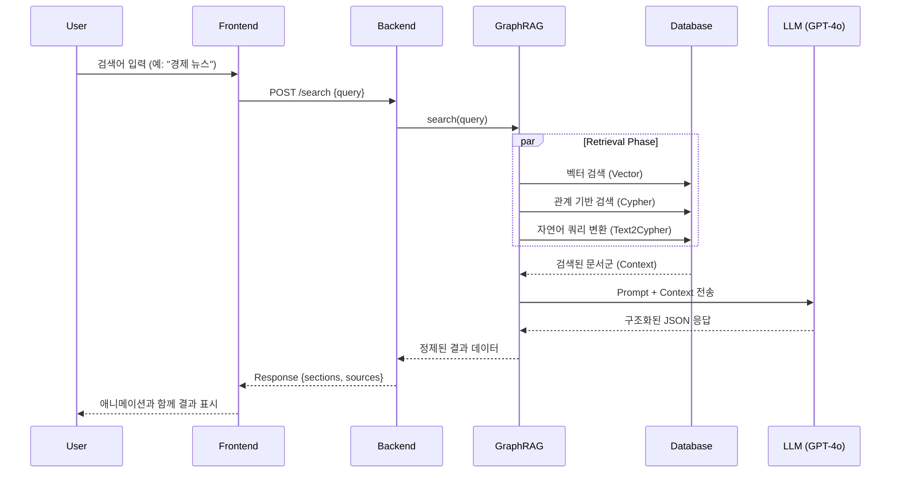

# AI News Search System: GraphRAG Engine


Neo4j 지식 그래프 기반 RAG 검색 시스템 (FastAPI 백엔드 + React 프론트엔드)

## 시스템 구성

### 백엔드 (FastAPI)
- **Neo4j GraphRAG** - 3가지 검색 방법 통합
  - VectorRetriever: 벡터 유사도 검색
  - VectorCypherRetriever: 벡터 + 그래프 쿼리
  - Text2CypherRetriever: 자연어 → Cypher 쿼리
- **OpenAI GPT-4o** - LLM 추론
- **자동 벡터 인덱스 생성**

### 시스템 아키텍처


### 프론트엔드 (React + Vite)
- **검색 UI** - 실시간 검색
- **인라인 출처 배지** - 문장 끝에 [출처명] 표시
- **마우스 호버 툴팁** - 상세 정보 팝업
- **로딩 & 에러 핸들링**

### 데이터 흐름도




## 설치 방법

### 1. 백엔드 의존성 설치
```bash
pip install fastapi uvicorn python-dotenv neo4j neo4j-graphrag openai
```

### 2. 프론트엔드 의존성 설치
```bash
cd frontend
npm install
```

### 3. 환경 변수 설정
`.env` 파일 생성:
```
NEO4J_URI=neo4j://127.0.0.1:7687
NEO4J_PASSWORD=your_password
OPENAI_API_KEY=your_api_key
```

## 실행 방법

### 1. 백엔드 서버 시작
```bash
# 루트 디렉토리에서
python app.py
```
→ http://localhost:8000 에서 실행

### 2. 프론트엔드 개발 서버 시작
```bash
# frontend 디렉토리에서
cd frontend
npm run dev
```
→ http://localhost:3000 에서 실행

→ http://localhost:3000 에서 실행

## 검색 예시 (Example Queries)

시스템에서 다음과 같은 다양한 유형의 검색이 가능합니다:

### 1. 카테고리별 검색
- "경제 분야 최신 뉴스"
- "IT/과학 관련 소식"
- "정치 동향은?"
- "사회 분야 주요 이슈"
- "생활/문화 관련 뉴스"
- "세계 뉴스 알려줘"

### 2. 언론사별 검색
- "매일경제에서 나온 최신 뉴스 보여줘"
- "연합뉴스 최신 소식"
- "SBS 뉴스 검색"
- "아시아경제 기사 알려줘"

### 3. 주제/키워드 검색
- "반도체 수출 관련 뉴스"
- "광역철도 사업"
- "금융권 성과보수"
- "증권사 CP 등급"
- "백화점 매출"
- "바이오 기업 인수"

### 4. 통계/분석 쿼리
- "카테고리별 기사 개수 알려줘"
- "언론사별 기사 수는 얼마야?"
- "최근 가장 많이 다룬 주제는?"

### 5. 복합 검색
- "경제 분야에서 매일경제가 보도한 뉴스"
- "IT 분야의 투자 관련 소식"
- "정치와 경제 관련 최신 이슈"

## API 엔드포인트


### POST /search
검색 쿼리 처리

**Request:**
```json
{
  "query": "경제 분야 최신 뉴스"
}
```

**Response:**
```json
{
  "sections": [
    {
      "title": "주요 동향",
      "content": "...",
      "sourceIds": [1, 2]
    }
  ],
  "sources": [
    {
      "id": 1,
      "shortName": "매일경제",
      "title": "기사 제목",
      "category": "경제",
      "date": "2025-12-23",
      "url": "https://...",
      "summary": "...",
      "icon": "💼"
    }
  ]
}
```

### GET /health
헬스 체크

## 프로젝트 구조
```
RAG_SYS/
├── app.py                    # FastAPI 백엔드
├── Tools_Retriever.py        # GraphRAG 검색 로직
├── Graph_Build.py            # Neo4j 그래프 구축
├── Data_Scrapping.py         # 데이터 수집
├── .env                      # 환경 변수
└── frontend/
    ├── package.json
    ├── vite.config.js
    ├── index.html
    └── src/
        ├── App.js            # 메인 앱
        ├── App.css
        ├── index.js
        └── components/
            ├── SearchBar.js      # 검색창
            ├── ResultSection.js  # 결과 섹션
            └── SourceTooltip.js  # 출처 툴팁
```

## 주요 기능

- **지능형 검색** - Neo4j GraphRAG 기반 하이브리드 검색
- **인라인 출처** - 문장 끝에 출처명 배지 표시
- **대화형 툴팁** - 마우스 호버 시 상세 정보
- **실시간 UI** - React 기반 동적 인터페이스
- **에러 핸들링** - 검색 실패 시 사용자 친화적 메시지

## 기술 스택
- **Backend**: FastAPI, Neo4j, OpenAI GPT-4o
- **Frontend**: React 18, Vite
- **Database**: Neo4j Graph Database
- **LLM**: OpenAI GPT-4o
- **Embeddings**: text-embedding-3-small
