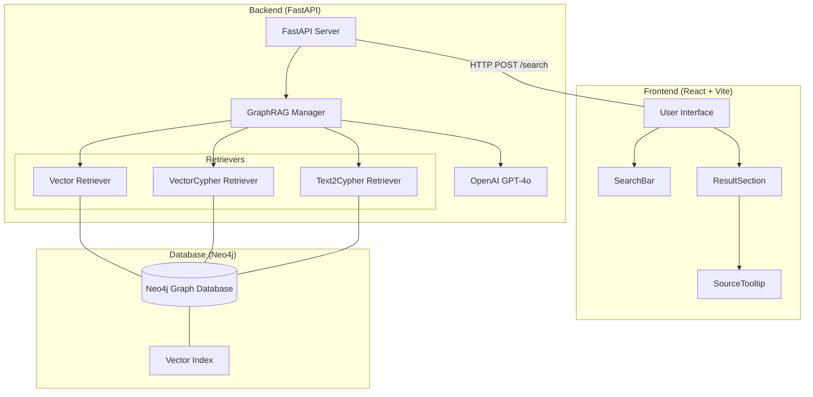
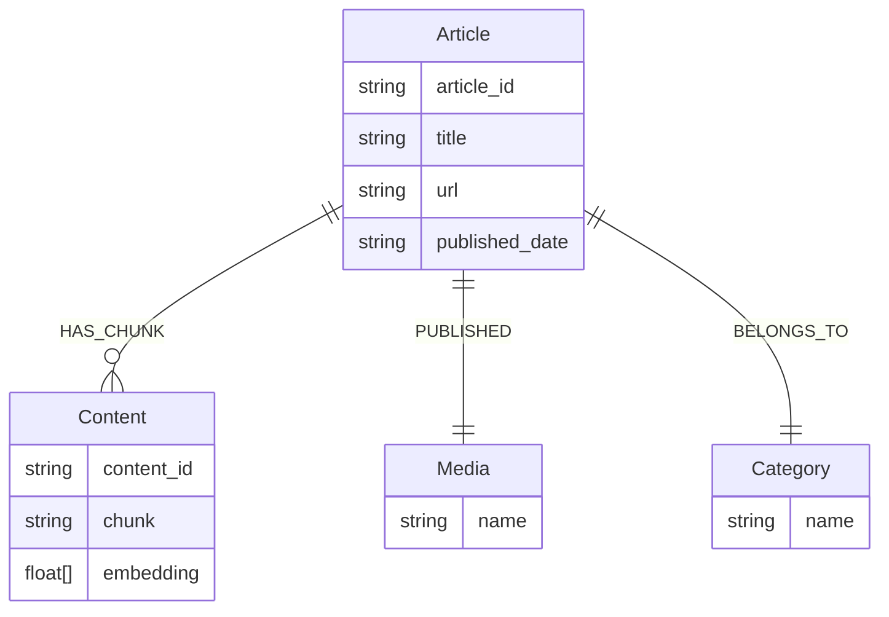
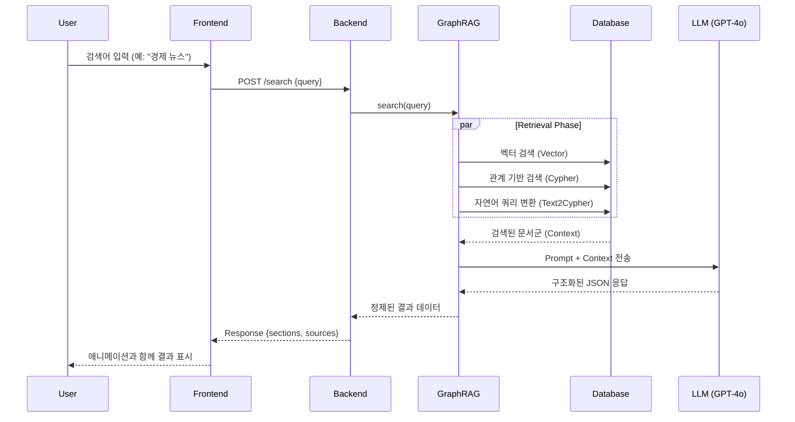

# AI 뉴스 검색 시스템 구조 시과화

이 문서는 Neo4j GraphRAG 기반의 FastAPI 백엔드와 React 프론트엔드 시스템의 구조를 시각화하여 설명합니다.

## 1. 전체 아키텍처 (Architecture)



## 2. 뉴스 데이터 모델 (Neo4j Schema)



## 3. 검색 데이터 흐름 (Search Data Flow)



## 4. 디렉토리 구조 (Directory Structure)

```text
RAG_SYS/
├── app.py                    # FastAPI 백엔드 엔트리포인트
├── README.md                 # 프로젝트 개요
├── system_structure.md       # (현재 파일) 시스템 구조 시각화
├── .env                      # API Key 및 DB 접속 정보
└── frontend/                 # React 프론트엔드 프로젝트
    ├── index.html            # 메인 HTML
    ├── vite.config.js        # Vite 설정
    └── src/
        ├── index.jsx         # React 진입점
        ├── App.jsx           # 메인 애플리케이션 컴포넌트
        ├── App.css           # 전체 스타일 및 애니메이션
        └── components/       # UI 컴포넌트
            ├── SearchBar.jsx # 검색창 컴포넌트
            ├── ResultSection.jsx # 결과 섹션 컴포넌트
            └── SourceTooltip.jsx # 출처 툴팁 컴포넌트
```
